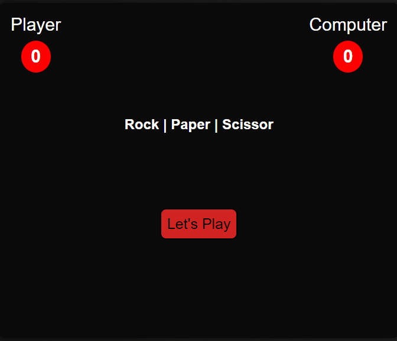
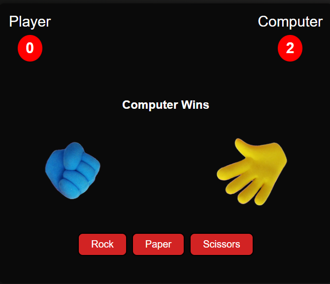

### By Akshun Verma

## Project Name: Rock Paper Scissor Game

- In this project I have made a game of rock, paper and scissor using HTML, CSS and JavaScript.In this game user can play with computer and even score of user and computer is also going to display side by side. This project really interesting to make. 

### ✍️ Author and 📞 Contact
- Akshun Verma
   - 
   - 

#### Honest time to finish the project !
 - I had taken around 3 hours to finish this project.

### Link of the website
- [Please Click Here](https://rock-paper-scissor-game45.netlify.app/)

- 

 ### Feedback
 - If you have any feedback, please reach out to me at akshunverma45@gmail.com
